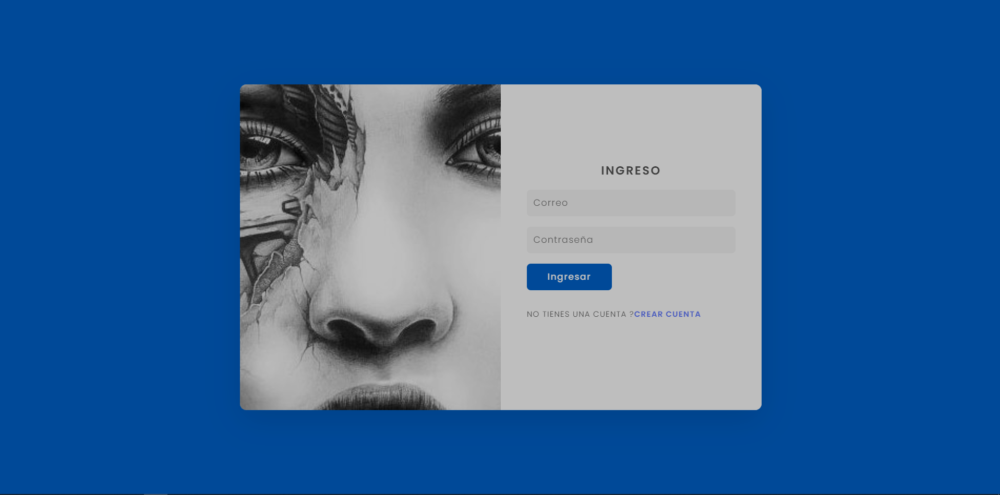
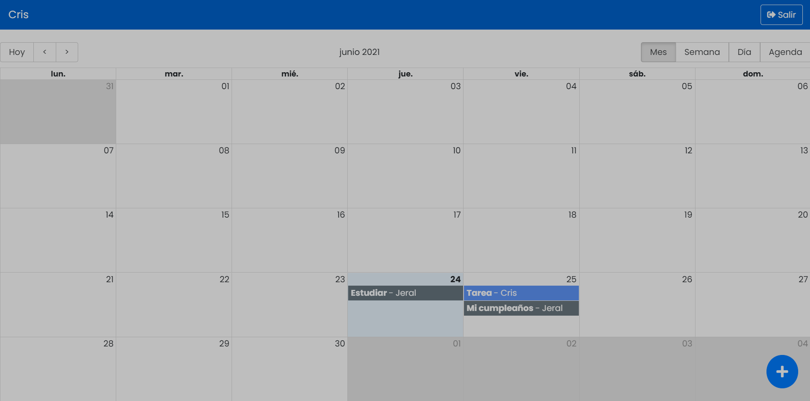

# Aplicación de Calendario (MERN y REDUX)

Aplicación para crear eventos en el calendario, editarlos y eliminarlos.

Login y registro de usuarios con autenticacion(JWT)

Reconstruir los modulos de node:

```
npm install
```

-  Crear 3 archivos de variables de entorno para producción y pruebas:

```
.env.test
.env.development
.env.production
.env.test
```

```
REACT_APP_API_URL=
```

[Probar App](https://mern-calendar-jp.herokuapp.com)



